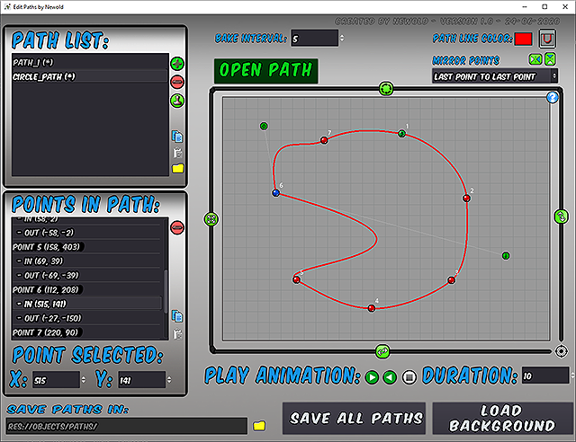

# PathEditor

Create or edit curve2D resource with a nice editor

A simple demonstration video: https://youtu.be/rIYYSKdQGUY

## Compatibility

This is the Godot v3.x version of the plugin; for Godot v2.x compatibility, check the `Godot_v2.x` branch. 

## Features:

* Load or Create curve2D resources
* Full control to edit each point in curve
* implemented undo, redo, copy, paste and duplicate actions.

## Installation:

You'll need the Godot Engine to run this.

To use PathEditor as an Addon:

1. Copy the "addons" folder to your project.
2. Enable **Edit Curve2D** addon on "Project Settings".
3. Now will appear a new item menu in "Project/Tools" called **Path Editor** and you can click it to open the Path Editor.

Done!

## Updates:

* 26/06/2020:
	* Setup of the finished project on GitHub.

## License:

MIT License.
